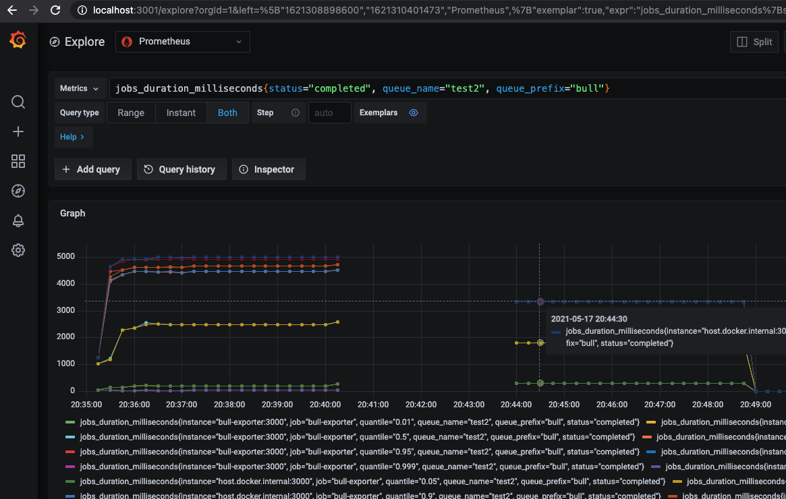

# bull-monitor
[](https://codeclimate.com/github/ejhayes/bull-monitor/maintainability) [](https://codeclimate.com/github/ejhayes/bull-monitor/test_coverage) [](https://hub.docker.com/r/ejhayes/nodejs-bull-monitor) 

This is an all-in-one tool to help you visualize and report on bull! It runs as a docker container that you can spin up with local development or host wherever you see fit. The core goal of this project is to provide realtime integration of your bull queues with existing bull tooling...without needing to run write any custom code. The following is automatically included:

- Automatic discovery of your bull queues (just point this at your redis instance)
- Automatic configuration of prometheus metrics for each discovered queue
- Configurable UI support to visualize bull queues (Bull Board or Arena)

To use with docker compose, add the following to `docker-compose.yml`:

```yml
bull-monitor:
  image: ejhayes/nodejs-bull-monitor:latest
  ports: 
    - 3000:3000
  environment:
    REDIS_HOST: <your redis host>
    REDIS_PORT: <your redis port>
    BULL_WATCH_QUEUE_PREFIXES: bull
    PORT: 3000
```

Then run `docker-compose up bull-monitor`. Assuming no issues, the following paths are available:

| Path | Description |
|-|-|
| [`/metrics`](localhos:3000/metrics) | Prometheus metrics |
| [`/health`](localhos:3000/metrics) | Health endpoint (always returns `HTTP 200` with `OK` text) |
| [`/docs`](localhos:3000/metrics) | Swagger UI |
| [`/docs-json`](localhos:3000/metrics) | Swagger JSON definition |
| [`/queues`](localhos:3000/metrics) | Bull UI (currently [`arena`](https://www.npmjs.com/package/bull-arena) or [`bull-board`](https://www.npmjs.com/package/bull-board)) |

## configuration
The following environment variables are supported:

| Environment Variable | Required | Default Value | Description |
|-|-|-|-|
| `REDIS_HOST` |x| `null` | Redis host (**IMPORTANT** must be same redis instance that stores bull jobs!) |
| `REDIS_PORT` |x| `null` | Redis port |
| `UI` | | `bull-board` | UI to use (supported: `arena`, `bull-board`) |
| `BULL_WATCH_QUEUE_PREFIXES` | | `bull` | Bull prefixes to monitor (globs like `prefix*` are supported) |
| `BULL_COLLECT_QUEUE_METRICS_INTERVAL_MS` | | `60000` | How often queue metrics are gathered |
| `COLLECT_NODEJS_METRICS` | | `false` | Collect NodeJS metrics and expose via prometheus |
| `COLLECT_NODEJS_METRICS_INTERVAL_MS` | | `60000` | How often to calculate NodeJS metrics (if enabled) |
| `REDIS_CONFIGURE_KEYSPACE_NOTIFICATIONS` | | `true` | Automatically configures redis keyspace notifications (typically not enabled by default). **IMPORTANT**: This will *NOT* work without keyspace notifications configured. |
| `LOG_LABEL` | | `bull-monitor` | Log label to use |
| `LOG_LEVEL` | | `info` | Log level to use (supported: `debug`, `error`, `info`, `warn`) |
| `NODE_ENV` | | `production` | Node environment |
| `PORT` | | `3000` | Port to use |

## getting started

To get started:

```
npm install
npm run services:start
npm run start:dev
```

If you want to run the tests:

```
npm run test
npm run test:e2e
```

To build the container (will be built/tagged as `ejhayes/nodejs-bull-monitor`):

```
npm run ci:build
```

## creating jobs
Want to try this out with your own bull queues? The code below can be used to create sample jobs:

```typescript
import Bull from 'bull'

const redisHost = process.env.REDIS_HOST || '127.0.0.1';
const redisPort = process.env.REDIS_PORT || '6001';
const queueName = process.env.QUEUE_NAME || 'send-email';
const queuePrefix = process.env.QUEUE_PREFIX || 'bull';
const intervalMs = process.env.INTERVAL_MS;
const maxJobsPerInterval = Number(process.env.MAX_JOBS_PER_INTERVAL || '50');
const processOnly = process.env.PROCESS_ONLY && process.env.PROCESS_ONLY === '1' ? true : false;

console.log(`Using redis host ${redisHost} on port ${redisPort}`);

// create queue
const queue = new Bull(queueName, {
    prefix: queuePrefix,
    redis: {
        host: redisHost,
        port: redisPort
    },
    limiter: {
      max: maxJobsPerInterval,
      duration: 5000,
    }
});

// add some dummy processing code
queue.process(async (job) => {
  const delay = Math.floor(Math.random() * config.DELAY_MS)
  console.log(`Starting job: ${job.id} with delay ${delay}`);
  job.log(`Starting job: ${job.id} with delay ${delay}`);

  const fail = Math.round(Math.random()) === 1 
  if (fail) {
    console.log(`Job ${job.id} marked to fail`);
    job.log(`Job ${job.id} marked to fail`);
    throw new Error(`Failing job ${job.id} for random reason`)
  }
  
  console.log(`Job ${job.id} is now complete after the delay`);
  job.log(`Job ${job.id} is now complete after the delay`);
});

if (!processOnly) {
  if (intervalMs) {
    console.log(`Creating job every ${intervalMs}ms`);
    setInterval(() => {
      console.log('Adding a job....');
      incr++;
      queue.add({
        myJobId: incr,
      }, { attempts: 3 });
    }, Number(intervalMs));
  }
  else {
    console.log('Creating single job');
    queue.add({someParam: 'someValue'}, {attempts: 3});
  }
}

```

Assuming the following is in `test.ts` and redis is running at `127.0.0.1:6001` you can run the script like this:

```
QUEUE_NAME=send-email QUEUE_PREFIX=bull INTERVAL_MS=1000 REDIS_HOST=127.0.0.1 REDIS_PORT=6001 npx ts-node test.ts
```

The example above creates a job queue called `send-email` with queue prefix `bull` and populates it with jobs every 1 second. Jobs will randomly fail and will be reattempted up to 3 times before being marked as failing. You can also process jobs only by setting `PROCESS_ONLY` to `1`.

## prometheus metrics
For each queue that is created  the following metrics are automatically tracked.

| Metric                              | type    | description                                             |
|-------------------------------------|---------|---------------------------------------------------------|
| jobs_completed_total                | counter | Total number of completed jobs                          |
| jobs_active_total                   | counter | Total number of active jobs (currently being processed) |
| jobs_delayed_total                  | counter | Total number of jobs that will run in the future        |
| jobs_failed_total                   | counter | Total number of failed jobs                             |
| jobs_waiting_total                  | counter | Total number of jobs waiting to be processed            |
| jobs_duration_milliseconds          | summary | Processing time for completed/failed                    |
| jobs_waiting_duration_milliseconds  | summary | Waiting time for completed/failed                       |
| jobs_attempts                       | summary | Processing time for completed/failed/jobs               |

Things to note about these metrics:
- Queue metrics are GLOBAL not worker specific
- Queue metrics are refreshed every 60 seconds. To change this simply you'll need to set environment variable `BULL_COLLECT_QUEUE_METRICS_INTERVAL_MS` to another value.
- Available prometheus labels: `queue_name`, `queue_prefix`, `status`

An example of the exposed metrics endpoint:
```
# HELP jobs_completed_total Number of completed jobs
# TYPE jobs_completed_total gauge
jobs_completed_total{queue_name="DAILY_EMAILS",queue_prefix="bull"} 555

# HELP jobs_failed_total Number of failed jobs
# TYPE jobs_failed_total gauge
jobs_failed_total{queue_name="DAILY_EMAILS",queue_prefix="bull"} 0

# HELP jobs_delayed_total Number of delayed jobs
# TYPE jobs_delayed_total gauge
jobs_delayed_total{queue_name="DAILY_EMAILS",queue_prefix="bull"} 739

# HELP jobs_active_total Number of active jobs
# TYPE jobs_active_total gauge
jobs_active_total{queue_name="DAILY_EMAILS",queue_prefix="bull"} 0

# HELP jobs_waiting_total Number of waiting jobs
# TYPE jobs_waiting_total gauge
jobs_waiting_total{queue_name="DAILY_EMAILS",queue_prefix="bull"} 0

# HELP jobs_duration_milliseconds Time to complete jobs
# TYPE jobs_duration_milliseconds summary
jobs_duration_milliseconds{quantile="0.01",status="completed",queue_name="test2",queue_prefix="bull"} 15.44
jobs_duration_milliseconds{quantile="0.05",status="completed",queue_name="test2",queue_prefix="bull"} 36.00000000000001
jobs_duration_milliseconds{quantile="0.5",status="completed",queue_name="test2",queue_prefix="bull"} 2268
jobs_duration_milliseconds{quantile="0.9",status="completed",queue_name="test2",queue_prefix="bull"} 4190.2
jobs_duration_milliseconds{quantile="0.95",status="completed",queue_name="test2",queue_prefix="bull"} 4343.4
jobs_duration_milliseconds{quantile="0.99",status="completed",queue_name="test2",queue_prefix="bull"} 4807.149999999999
jobs_duration_milliseconds{quantile="0.999",status="completed",queue_name="test2",queue_prefix="bull"} 4844
jobs_duration_milliseconds_sum{status="completed",queue_name="test2",queue_prefix="bull"} 130904
jobs_duration_milliseconds_count{status="completed",queue_name="test2",queue_prefix="bull"} 61

# HELP jobs_waiting_duration_milliseconds Time spent waiting for a job to run
# TYPE jobs_waiting_duration_milliseconds summary
jobs_waiting_duration_milliseconds{quantile="0.01",status="completed",queue_name="test2",queue_prefix="bull"} 15317.1
jobs_waiting_duration_milliseconds{quantile="0.05",status="completed",queue_name="test2",queue_prefix="bull"} 15482.55
jobs_waiting_duration_milliseconds{quantile="0.5",status="completed",queue_name="test2",queue_prefix="bull"} 18996
jobs_waiting_duration_milliseconds{quantile="0.9",status="completed",queue_name="test2",queue_prefix="bull"} 22566.600000000002
jobs_waiting_duration_milliseconds{quantile="0.95",status="completed",queue_name="test2",queue_prefix="bull"} 23332.15
jobs_waiting_duration_milliseconds{quantile="0.99",status="completed",queue_name="test2",queue_prefix="bull"} 24662.649999999994
jobs_waiting_duration_milliseconds{quantile="0.999",status="completed",queue_name="test2",queue_prefix="bull"} 24826
jobs_waiting_duration_milliseconds_sum{status="completed",queue_name="test2",queue_prefix="bull"} 1159713
jobs_waiting_duration_milliseconds_count{status="completed",queue_name="test2",queue_prefix="bull"} 61

# HELP jobs_attempts Job attempts made
# TYPE jobs_attempts summary
jobs_attempts{quantile="0.01",status="completed",queue_name="test2",queue_prefix="bull"} 0
jobs_attempts{quantile="0.05",status="completed",queue_name="test2",queue_prefix="bull"} 0
jobs_attempts{quantile="0.5",status="completed",queue_name="test2",queue_prefix="bull"} 0
jobs_attempts{quantile="0.9",status="completed",queue_name="test2",queue_prefix="bull"} 0
jobs_attempts{quantile="0.95",status="completed",queue_name="test2",queue_prefix="bull"} 0
jobs_attempts{quantile="0.99",status="completed",queue_name="test2",queue_prefix="bull"} 0
jobs_attempts{quantile="0.999",status="completed",queue_name="test2",queue_prefix="bull"} 0
jobs_attempts_sum{status="completed",queue_name="test2",queue_prefix="bull"} 0
jobs_attempts_count{status="completed",queue_name="test2",queue_prefix="bull"} 61
```

Note that you can integrate this with Grafana to set up things like alerts for queues. 



Want to play around with all this stuff locally? You can spin everything needed by running:

```
npm run services:start:all

# OR spin up only dependent services, but run bull-monitor locally
npm run services:start
npm run start:dev
```

Once completed the following will be available:
- Grafana UI: http://localhost:3001
- Prometheus: http://localhost:3002
- SMTP (Mailhog): http:localhost: http://localhost:3003 (username: `test`, password: `test`)
- Redis: `localhost:6001`
- SMTP Server (used by Grafana Alerts): `localhost:6002` (no auth required, no encryption)

When you are done you can get rid of everything with:
```
npm run services:remove

# OR if you want to stop without removing
npm run services:stop
```

## Available UIs
There are 2 options currently available for UIs: bull-board and arena.

## bull-board
From: https://github.com/felixmosh/bull-board#readme. This is the default UI. If you want to be explicit just set `UI` environment variable to `bull-board`.


## bull-arena
From: https://github.com/bee-queue/arena. To use this UI you'll need to set the `UI` environment variable to `arena`.


## Security Considerations
- This is intended as a back office monitoring solution. You should not make expose this publicly
- This is currently intended to run as a single process and should not be scaled horizontally (future todo item)

## Roadmap
See the [roadmap](https://github.com/ejhayes/bull-monitor/projects/1) for idas on how to improve this project.
