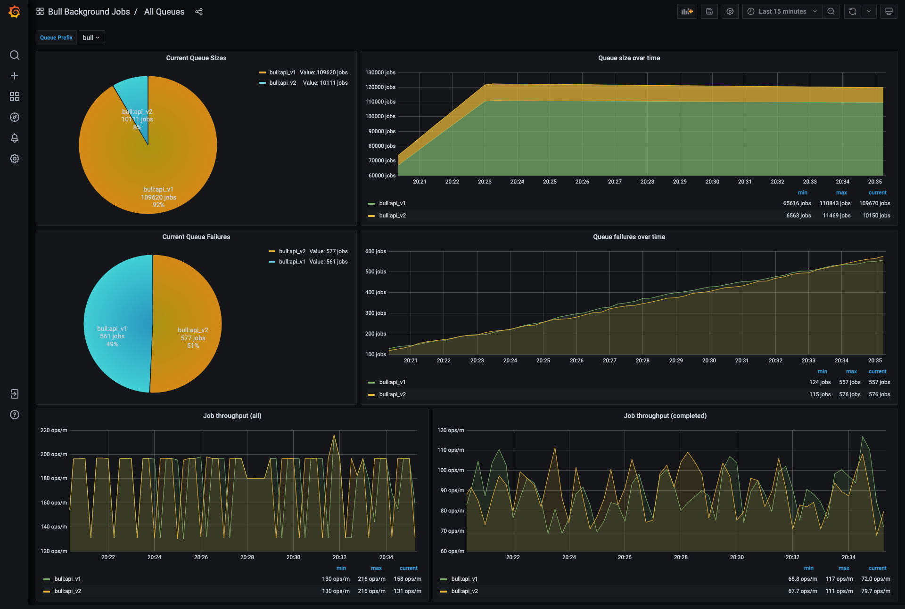
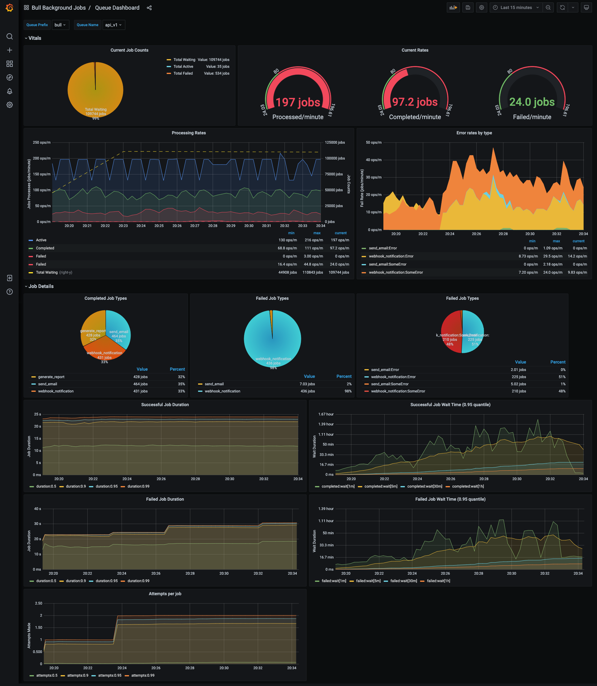
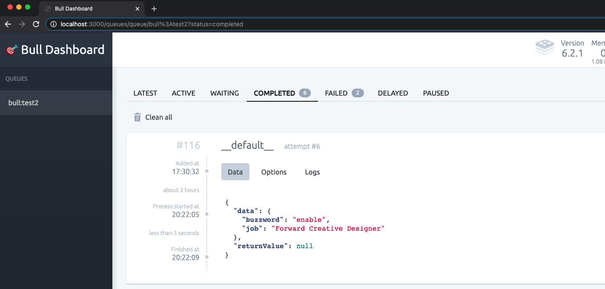
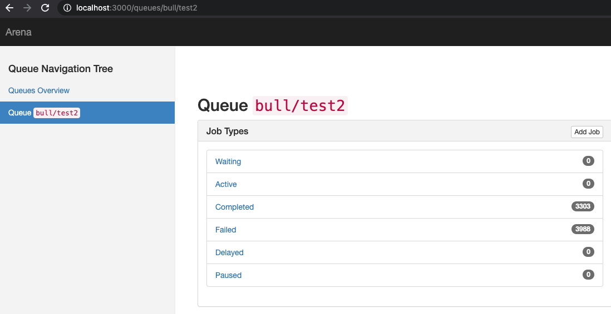

# bull-monitor
[](https://codeclimate.com/github/ejhayes/bull-monitor/maintainability) [](https://codeclimate.com/github/ejhayes/bull-monitor/test_coverage) [](https://hub.docker.com/r/ejhayes/nodejs-bull-monitor) <!-- ALL-CONTRIBUTORS-BADGE:START - Do not remove or modify this section -->
[](#contributors-)
<!-- ALL-CONTRIBUTORS-BADGE:END -->

This is an all-in-one tool to help you visualize and report on bull! It runs as a docker container that you can spin up with local development or host wherever you see fit. The core goal of this project is to provide realtime integration of your bull queues with existing bull tooling...without needing to run write any custom code. The following is automatically included:

- Automatic discovery of your bull queues (just point this at your redis instance)
- Automatic configuration of prometheus metrics for each discovered queue
- Configurable UI support to visualize bull queues (Bull Board or Arena)

You can test it out with docker by running (if you want to access something running on your host machine and not within the docker network you can use the special hostname [`host.docker.internal`](https://docs.docker.com/docker-for-mac/networking/#use-cases-and-workarounds)):

```sh
docker run -d --rm \
  --name bull-monitor \
  -e "REDIS_HOST=host.docker.internal" \
  -e "REDIS_PORT=6001" \
  -e "PORT=3000" \
  -e "BULL_WATCH_QUEUE_PREFIXES=bull" \
  -p 3000:3000 \
  ejhayes/nodejs-bull-monitor:latest
```

To use with docker compose, add the following to `docker-compose.yml`:

```yml
bull-monitor:
  image: ejhayes/nodejs-bull-monitor:latest
  ports: 
    - 3000:3000
  environment:
    REDIS_HOST: <your redis host>
    REDIS_PORT: <your redis port>
    BULL_WATCH_QUEUE_PREFIXES: bull
    PORT: 3000
```

Then run `docker-compose up bull-monitor`. Assuming no issues, the following paths are available:

| Path | Description |
|-|-|
| [`/metrics`](localhos:3000/metrics) | Prometheus metrics |
| [`/health`](localhos:3000/metrics) | Health endpoint (always returns `HTTP 200` with `OK` text) |
| [`/docs`](localhos:3000/metrics) | Swagger UI |
| [`/docs-json`](localhos:3000/metrics) | Swagger JSON definition |
| [`/queues`](localhos:3000/metrics) | Bull UI (currently [`arena`](https://www.npmjs.com/package/bull-arena) or [`bull-board`](https://www.npmjs.com/package/bull-board)) |

## configuration
The following environment variables are supported:

| Environment Variable | Required | Default Value | Description |
|-|-|-|-|
| `REDIS_HOST` |x| `null` | Redis host (**IMPORTANT** must be same redis instance that stores bull jobs!) |
| `REDIS_PORT` |x| `null` | Redis port |
| `UI` | | `bull-board` | UI to use (supported: `arena`, `bull-board`) |
| `BULL_WATCH_QUEUE_PREFIXES` | | `bull` | Bull prefixes to monitor (globs like `prefix*` are supported) |
| `BULL_COLLECT_QUEUE_METRICS_INTERVAL_MS` | | `60000` | How often queue metrics are gathered |
| `COLLECT_NODEJS_METRICS` | | `false` | Collect NodeJS metrics and expose via prometheus |
| `COLLECT_NODEJS_METRICS_INTERVAL_MS` | | `60000` | How often to calculate NodeJS metrics (if enabled) |
| `REDIS_CONFIGURE_KEYSPACE_NOTIFICATIONS` | | `true` | Automatically configures redis keyspace notifications (typically not enabled by default). **IMPORTANT**: This will *NOT* work without keyspace notifications configured. |
| `LOG_LABEL` | | `bull-monitor` | Log label to use |
| `LOG_LEVEL` | | `info` | Log level to use (supported: `debug`, `error`, `info`, `warn`) |
| `NODE_ENV` | | `production` | Node environment |
| `PORT` | | `3000` | Port to use |

## getting started

To get started:

```
npm install
npm run services:start
npm run start:dev
```

If you want to run the tests:

```
npm run test
npm run test:e2e
```

To build the container (will be built/tagged as `ejhayes/nodejs-bull-monitor`):

```
npm run ci:build
```

## creating jobs
Want to try this out with your own bull queues? The code below can be used to create sample jobs:

```typescript
import Bull from 'bull'

const redisHost = process.env.REDIS_HOST || '127.0.0.1';
const redisPort = process.env.REDIS_PORT || '6001';
const queueName = process.env.QUEUE_NAME || 'send-email';
const queuePrefix = process.env.QUEUE_PREFIX || 'bull';
const intervalMs = process.env.INTERVAL_MS;
const maxJobsPerInterval = Number(process.env.MAX_JOBS_PER_INTERVAL || '50');
const processOnly = process.env.PROCESS_ONLY && process.env.PROCESS_ONLY === '1' ? true : false;

console.log(`Using redis host ${redisHost} on port ${redisPort}`);

// create queue
const queue = new Bull(queueName, {
    prefix: queuePrefix,
    redis: {
        host: redisHost,
        port: redisPort
    },
    limiter: {
      max: maxJobsPerInterval,
      duration: 5000,
    }
});

// add some dummy processing code
queue.process(async (job) => {
  const delay = Math.floor(Math.random() * config.DELAY_MS)
  console.log(`Starting job: ${job.id} with delay ${delay}`);
  job.log(`Starting job: ${job.id} with delay ${delay}`);

  const fail = Math.round(Math.random()) === 1 
  if (fail) {
    console.log(`Job ${job.id} marked to fail`);
    job.log(`Job ${job.id} marked to fail`);
    throw new Error(`Failing job ${job.id} for random reason`)
  }
  
  console.log(`Job ${job.id} is now complete after the delay`);
  job.log(`Job ${job.id} is now complete after the delay`);
});

if (!processOnly) {
  if (intervalMs) {
    console.log(`Creating job every ${intervalMs}ms`);
    setInterval(() => {
      console.log('Adding a job....');
      incr++;
      queue.add({
        myJobId: incr,
      }, { attempts: 3 });
    }, Number(intervalMs));
  }
  else {
    console.log('Creating single job');
    queue.add({someParam: 'someValue'}, {attempts: 3});
  }
}

```

Assuming the following is in `test.ts` and redis is running at `127.0.0.1:6001` you can run the script like this:

```
QUEUE_NAME=send-email QUEUE_PREFIX=bull INTERVAL_MS=1000 REDIS_HOST=127.0.0.1 REDIS_PORT=6001 npx ts-node test.ts
```

The example above creates a job queue called `send-email` with queue prefix `bull` and populates it with jobs every 1 second. Jobs will randomly fail and will be reattempted up to 3 times before being marked as failing. You can also process jobs only by setting `PROCESS_ONLY` to `1`.

## prometheus metrics
For each queue that is created  the following metrics are automatically tracked.

| Metric                              | type    | description                                             |
|-------------------------------------|---------|---------------------------------------------------------|
| `jobs_completed_total` | `gauge` | Total number of completed jobs |
| `jobs_failed_total` | `gauge` | Total number of failed jobs |
| `jobs_delayed_total` | `gauge` | Total number of delayed jobs |
| `jobs_active_total` | `gauge` | Total number of active jobs |
| `jobs_waiting_total` | `gauge` | Total number of waiting jobs |
| `jobs_active` | `counter` | Jobs active |
| `jobs_waiting` | `counter` | Jobs waiting |
| `jobs_stalled` | `counter` | Jobs stalled |
| `jobs_failed` | `counter` | Jobs failed |
| `jobs_completed` | `counter` | Jobs completed |
| `jobs_delayed` | `counter` | Jobs delayed |
| `job_duration` | `summary` | Processing time for completed/failed jobs |
| `job_wait_duration` | `summary` | Durating spent waiting for job to start |
| `job_attempts` | `summary` | Number of attempts made before job completed/failed |

The following labels are available:

| Label Name | Description |
|-|-|
| `queue_prefix` | Queue Prefix |
| `queue_name` | Queue Name |
| `job_name` | Job name |
| `status` | Job status (choiced: `completed`, `failed`) |
| `error_type` | Error type (uses error class name) |

Things to note about these metrics:
- Queue metrics are GLOBAL not worker specific
- Gauge metrics (`*_total`) are refreshed every 60 seconds. To change this you'll need to set environment variable `BULL_COLLECT_QUEUE_METRICS_INTERVAL_MS` to another value.

An example of the exposed metrics endpoint:
```
# HELP jobs_active_total Total active jobs
# TYPE jobs_active_total gauge
jobs_active_total{queue_prefix="bull",queue_name="api_v1"} 93
jobs_active_total{queue_prefix="bull",queue_name="api_v2"} 0

# HELP jobs_completed_total Total completed jobs
# TYPE jobs_completed_total gauge
jobs_completed_total{queue_prefix="bull",queue_name="api_v1"} 3058
jobs_completed_total{queue_prefix="bull",queue_name="api_v2"} 2981

# HELP jobs_failed_total Total failed jobs
# TYPE jobs_failed_total gauge
jobs_failed_total{queue_prefix="bull",queue_name="api_v1"} 1004
jobs_failed_total{queue_prefix="bull",queue_name="api_v2"} 1040

# HELP jobs_waiting_total Total waiting jobs
# TYPE jobs_waiting_total gauge
jobs_waiting_total{queue_prefix="bull",queue_name="api_v1"} 41004
jobs_waiting_total{queue_prefix="bull",queue_name="api_v2"} 8439

# HELP jobs_delayed_total Total delayed jobs
# TYPE jobs_delayed_total gauge
jobs_delayed_total{queue_prefix="bull",queue_name="api_v1"} 67038
jobs_delayed_total{queue_prefix="bull",queue_name="api_v2"} 122

# HELP jobs_active Number of active jobs
# TYPE jobs_active counter
jobs_active{job_name="generate_report",queue_prefix="bull",queue_name="api_v1"} 21
jobs_active{job_name="webhook_notification",queue_prefix="bull",queue_name="api_v1"} 18
jobs_active{job_name="send_email",queue_prefix="bull",queue_name="api_v1"} 21

# HELP jobs_waiting Number of waiting jobs
# TYPE jobs_waiting counter
jobs_waiting{job_name="webhook_notification",queue_prefix="bull",queue_name="api_v1"} 12446
jobs_waiting{job_name="send_email",queue_prefix="bull",queue_name="api_v1"} 12778
jobs_waiting{job_name="generate_report",queue_prefix="bull",queue_name="api_v1"} 12767
jobs_waiting{job_name="webhook_notification",queue_prefix="bull",queue_name="api_v2"} 1800
jobs_waiting{job_name="send_email",queue_prefix="bull",queue_name="api_v2"} 2242
jobs_waiting{job_name="generate_report",queue_prefix="bull",queue_name="api_v2"} 2402

# HELP jobs_failed Number of failed jobs
# TYPE jobs_failed counter
jobs_failed{job_name="webhook_notification",error_type="Error",queue_prefix="bull",queue_name="api_v1"} 2
jobs_failed{job_name="webhook_notification",error_type="SomeError",queue_prefix="bull",queue_name="api_v1"} 1

# HELP jobs_completed Number of completed jobs
# TYPE jobs_completed counter
jobs_completed{job_name="webhook_notification",queue_prefix="bull",queue_name="api_v1"} 3
jobs_completed{job_name="generate_report",queue_prefix="bull",queue_name="api_v1"} 4
jobs_completed{job_name="send_email",queue_prefix="bull",queue_name="api_v1"} 1

# HELP jobs_stalled Number of stalled jobs
# TYPE jobs_stalled counter

# HELP jobs_delayed Number of delayed jobs
# TYPE jobs_delayed counter
jobs_delayed{job_name="generate_report",queue_prefix="bull",queue_name="api_v1"} 516
jobs_delayed{job_name="send_email",queue_prefix="bull",queue_name="api_v1"} 515
jobs_delayed{job_name="webhook_notification",queue_prefix="bull",queue_name="api_v1"} 460

# HELP job_duration Job duration
# TYPE job_duration summary
job_duration{quantile="0.01",status="failed",job_name="webhook_notification",error_type="Error",queue_prefix="bull",queue_name="api_v1"} 745
job_duration{quantile="0.05",status="failed",job_name="webhook_notification",error_type="Error",queue_prefix="bull",queue_name="api_v1"} 745
job_duration{quantile="0.5",status="failed",job_name="webhook_notification",error_type="Error",queue_prefix="bull",queue_name="api_v1"} 774
job_duration{quantile="0.9",status="failed",job_name="webhook_notification",error_type="Error",queue_prefix="bull",queue_name="api_v1"} 803
job_duration{quantile="0.95",status="failed",job_name="webhook_notification",error_type="Error",queue_prefix="bull",queue_name="api_v1"} 803
job_duration{quantile="0.99",status="failed",job_name="webhook_notification",error_type="Error",queue_prefix="bull",queue_name="api_v1"} 803
job_duration{quantile="0.999",status="failed",job_name="webhook_notification",error_type="Error",queue_prefix="bull",queue_name="api_v1"} 803
job_duration_sum{status="failed",job_name="webhook_notification",error_type="Error",queue_prefix="bull",queue_name="api_v1"} 1548
job_duration_count{status="failed",job_name="webhook_notification",error_type="Error",queue_prefix="bull",queue_name="api_v1"} 2
job_duration{quantile="0.01",status="completed",job_name="webhook_notification",queue_prefix="bull",queue_name="api_v1"} 1091
job_duration{quantile="0.05",status="completed",job_name="webhook_notification",queue_prefix="bull",queue_name="api_v1"} 1091
job_duration{quantile="0.5",status="completed",job_name="webhook_notification",queue_prefix="bull",queue_name="api_v1"} 1638
job_duration{quantile="0.9",status="completed",job_name="webhook_notification",queue_prefix="bull",queue_name="api_v1"} 1667
job_duration{quantile="0.95",status="completed",job_name="webhook_notification",queue_prefix="bull",queue_name="api_v1"} 1667
job_duration{quantile="0.99",status="completed",job_name="webhook_notification",queue_prefix="bull",queue_name="api_v1"} 1667
job_duration{quantile="0.999",status="completed",job_name="webhook_notification",queue_prefix="bull",queue_name="api_v1"} 1667
job_duration_sum{status="completed",job_name="webhook_notification",queue_prefix="bull",queue_name="api_v1"} 4396
job_duration_count{status="completed",job_name="webhook_notification",queue_prefix="bull",queue_name="api_v1"} 3
job_duration{quantile="0.01",status="completed",job_name="generate_report",queue_prefix="bull",queue_name="api_v1"} 1274
job_duration{quantile="0.05",status="completed",job_name="generate_report",queue_prefix="bull",queue_name="api_v1"} 1274
job_duration{quantile="0.5",status="completed",job_name="generate_report",queue_prefix="bull",queue_name="api_v1"} 1968.5
job_duration{quantile="0.9",status="completed",job_name="generate_report",queue_prefix="bull",queue_name="api_v1"} 2460
job_duration{quantile="0.95",status="completed",job_name="generate_report",queue_prefix="bull",queue_name="api_v1"} 2460
job_duration{quantile="0.99",status="completed",job_name="generate_report",queue_prefix="bull",queue_name="api_v1"} 2460
job_duration{quantile="0.999",status="completed",job_name="generate_report",queue_prefix="bull",queue_name="api_v1"} 2460
job_duration_sum{status="completed",job_name="generate_report",queue_prefix="bull",queue_name="api_v1"} 7671
job_duration_count{status="completed",job_name="generate_report",queue_prefix="bull",queue_name="api_v1"} 4
job_duration{quantile="0.01",status="completed",job_name="send_email",queue_prefix="bull",queue_name="api_v1"} 1915
job_duration{quantile="0.05",status="completed",job_name="send_email",queue_prefix="bull",queue_name="api_v1"} 1915
job_duration{quantile="0.5",status="completed",job_name="send_email",queue_prefix="bull",queue_name="api_v1"} 1915
job_duration{quantile="0.9",status="completed",job_name="send_email",queue_prefix="bull",queue_name="api_v1"} 1915
job_duration{quantile="0.95",status="completed",job_name="send_email",queue_prefix="bull",queue_name="api_v1"} 1915
job_duration{quantile="0.99",status="completed",job_name="send_email",queue_prefix="bull",queue_name="api_v1"} 1915
job_duration{quantile="0.999",status="completed",job_name="send_email",queue_prefix="bull",queue_name="api_v1"} 1915
job_duration_sum{status="completed",job_name="send_email",queue_prefix="bull",queue_name="api_v1"} 1915
job_duration_count{status="completed",job_name="send_email",queue_prefix="bull",queue_name="api_v1"} 1
job_duration{quantile="0.01",status="failed",job_name="webhook_notification",error_type="SomeError",queue_prefix="bull",queue_name="api_v1"} 2627
job_duration{quantile="0.05",status="failed",job_name="webhook_notification",error_type="SomeError",queue_prefix="bull",queue_name="api_v1"} 2627
job_duration{quantile="0.5",status="failed",job_name="webhook_notification",error_type="SomeError",queue_prefix="bull",queue_name="api_v1"} 2627
job_duration{quantile="0.9",status="failed",job_name="webhook_notification",error_type="SomeError",queue_prefix="bull",queue_name="api_v1"} 2627
job_duration{quantile="0.95",status="failed",job_name="webhook_notification",error_type="SomeError",queue_prefix="bull",queue_name="api_v1"} 2627
job_duration{quantile="0.99",status="failed",job_name="webhook_notification",error_type="SomeError",queue_prefix="bull",queue_name="api_v1"} 2627
job_duration{quantile="0.999",status="failed",job_name="webhook_notification",error_type="SomeError",queue_prefix="bull",queue_name="api_v1"} 2627
job_duration_sum{status="failed",job_name="webhook_notification",error_type="SomeError",queue_prefix="bull",queue_name="api_v1"} 2627
job_duration_count{status="failed",job_name="webhook_notification",error_type="SomeError",queue_prefix="bull",queue_name="api_v1"} 1

# HELP job_wait_duration Job waiting duration
# TYPE job_wait_duration summary
job_wait_duration{quantile="0.01",status="failed",job_name="webhook_notification",error_type="Error",queue_prefix="bull",queue_name="api_v1"} 1888140
job_wait_duration{quantile="0.05",status="failed",job_name="webhook_notification",error_type="Error",queue_prefix="bull",queue_name="api_v1"} 1888140
job_wait_duration{quantile="0.5",status="failed",job_name="webhook_notification",error_type="Error",queue_prefix="bull",queue_name="api_v1"} 2010600.5
job_wait_duration{quantile="0.9",status="failed",job_name="webhook_notification",error_type="Error",queue_prefix="bull",queue_name="api_v1"} 2133061
job_wait_duration{quantile="0.95",status="failed",job_name="webhook_notification",error_type="Error",queue_prefix="bull",queue_name="api_v1"} 2133061
job_wait_duration{quantile="0.99",status="failed",job_name="webhook_notification",error_type="Error",queue_prefix="bull",queue_name="api_v1"} 2133061
job_wait_duration{quantile="0.999",status="failed",job_name="webhook_notification",error_type="Error",queue_prefix="bull",queue_name="api_v1"} 2133061
job_wait_duration_sum{status="failed",job_name="webhook_notification",error_type="Error",queue_prefix="bull",queue_name="api_v1"} 4021201
job_wait_duration_count{status="failed",job_name="webhook_notification",error_type="Error",queue_prefix="bull",queue_name="api_v1"} 2
job_wait_duration{quantile="0.01",status="completed",job_name="webhook_notification",queue_prefix="bull",queue_name="api_v1"} 1962012
job_wait_duration{quantile="0.05",status="completed",job_name="webhook_notification",queue_prefix="bull",queue_name="api_v1"} 1962012
job_wait_duration{quantile="0.5",status="completed",job_name="webhook_notification",queue_prefix="bull",queue_name="api_v1"} 2048861
job_wait_duration{quantile="0.9",status="completed",job_name="webhook_notification",queue_prefix="bull",queue_name="api_v1"} 2079918
job_wait_duration{quantile="0.95",status="completed",job_name="webhook_notification",queue_prefix="bull",queue_name="api_v1"} 2079918
job_wait_duration{quantile="0.99",status="completed",job_name="webhook_notification",queue_prefix="bull",queue_name="api_v1"} 2079918
job_wait_duration{quantile="0.999",status="completed",job_name="webhook_notification",queue_prefix="bull",queue_name="api_v1"} 2079918
job_wait_duration_sum{status="completed",job_name="webhook_notification",queue_prefix="bull",queue_name="api_v1"} 6090791
job_wait_duration_count{status="completed",job_name="webhook_notification",queue_prefix="bull",queue_name="api_v1"} 3
job_wait_duration{quantile="0.01",status="completed",job_name="generate_report",queue_prefix="bull",queue_name="api_v1"} 2046775
job_wait_duration{quantile="0.05",status="completed",job_name="generate_report",queue_prefix="bull",queue_name="api_v1"} 2046775
job_wait_duration{quantile="0.5",status="completed",job_name="generate_report",queue_prefix="bull",queue_name="api_v1"} 2125960
job_wait_duration{quantile="0.9",status="completed",job_name="generate_report",queue_prefix="bull",queue_name="api_v1"} 2158130
job_wait_duration{quantile="0.95",status="completed",job_name="generate_report",queue_prefix="bull",queue_name="api_v1"} 2158130
job_wait_duration{quantile="0.99",status="completed",job_name="generate_report",queue_prefix="bull",queue_name="api_v1"} 2158130
job_wait_duration{quantile="0.999",status="completed",job_name="generate_report",queue_prefix="bull",queue_name="api_v1"} 2158130
job_wait_duration_sum{status="completed",job_name="generate_report",queue_prefix="bull",queue_name="api_v1"} 8456825
job_wait_duration_count{status="completed",job_name="generate_report",queue_prefix="bull",queue_name="api_v1"} 4
job_wait_duration{quantile="0.01",status="completed",job_name="send_email",queue_prefix="bull",queue_name="api_v1"} 2068343
job_wait_duration{quantile="0.05",status="completed",job_name="send_email",queue_prefix="bull",queue_name="api_v1"} 2068343
job_wait_duration{quantile="0.5",status="completed",job_name="send_email",queue_prefix="bull",queue_name="api_v1"} 2068343
job_wait_duration{quantile="0.9",status="completed",job_name="send_email",queue_prefix="bull",queue_name="api_v1"} 2068343
job_wait_duration{quantile="0.95",status="completed",job_name="send_email",queue_prefix="bull",queue_name="api_v1"} 2068343
job_wait_duration{quantile="0.99",status="completed",job_name="send_email",queue_prefix="bull",queue_name="api_v1"} 2068343
job_wait_duration{quantile="0.999",status="completed",job_name="send_email",queue_prefix="bull",queue_name="api_v1"} 2068343
job_wait_duration_sum{status="completed",job_name="send_email",queue_prefix="bull",queue_name="api_v1"} 2068343
job_wait_duration_count{status="completed",job_name="send_email",queue_prefix="bull",queue_name="api_v1"} 1
job_wait_duration{quantile="0.01",status="failed",job_name="webhook_notification",error_type="SomeError",queue_prefix="bull",queue_name="api_v1"} 2155327
job_wait_duration{quantile="0.05",status="failed",job_name="webhook_notification",error_type="SomeError",queue_prefix="bull",queue_name="api_v1"} 2155327
job_wait_duration{quantile="0.5",status="failed",job_name="webhook_notification",error_type="SomeError",queue_prefix="bull",queue_name="api_v1"} 2155327
job_wait_duration{quantile="0.9",status="failed",job_name="webhook_notification",error_type="SomeError",queue_prefix="bull",queue_name="api_v1"} 2155327
job_wait_duration{quantile="0.95",status="failed",job_name="webhook_notification",error_type="SomeError",queue_prefix="bull",queue_name="api_v1"} 2155327
job_wait_duration{quantile="0.99",status="failed",job_name="webhook_notification",error_type="SomeError",queue_prefix="bull",queue_name="api_v1"} 2155327
job_wait_duration{quantile="0.999",status="failed",job_name="webhook_notification",error_type="SomeError",queue_prefix="bull",queue_name="api_v1"} 2155327
job_wait_duration_sum{status="failed",job_name="webhook_notification",error_type="SomeError",queue_prefix="bull",queue_name="api_v1"} 2155327
job_wait_duration_count{status="failed",job_name="webhook_notification",error_type="SomeError",queue_prefix="bull",queue_name="api_v1"} 1

# HELP job_attempts Job attempts
# TYPE job_attempts summary
job_attempts{quantile="0.01",status="failed",job_name="webhook_notification",error_type="Error",queue_prefix="bull",queue_name="api_v1"} 1
job_attempts{quantile="0.05",status="failed",job_name="webhook_notification",error_type="Error",queue_prefix="bull",queue_name="api_v1"} 1
job_attempts{quantile="0.5",status="failed",job_name="webhook_notification",error_type="Error",queue_prefix="bull",queue_name="api_v1"} 1
job_attempts{quantile="0.9",status="failed",job_name="webhook_notification",error_type="Error",queue_prefix="bull",queue_name="api_v1"} 1
job_attempts{quantile="0.95",status="failed",job_name="webhook_notification",error_type="Error",queue_prefix="bull",queue_name="api_v1"} 1
job_attempts{quantile="0.99",status="failed",job_name="webhook_notification",error_type="Error",queue_prefix="bull",queue_name="api_v1"} 1
job_attempts{quantile="0.999",status="failed",job_name="webhook_notification",error_type="Error",queue_prefix="bull",queue_name="api_v1"} 1
job_attempts_sum{status="failed",job_name="webhook_notification",error_type="Error",queue_prefix="bull",queue_name="api_v1"} 2
job_attempts_count{status="failed",job_name="webhook_notification",error_type="Error",queue_prefix="bull",queue_name="api_v1"} 2
job_attempts{quantile="0.01",status="completed",job_name="webhook_notification",queue_prefix="bull",queue_name="api_v1"} 0
job_attempts{quantile="0.05",status="completed",job_name="webhook_notification",queue_prefix="bull",queue_name="api_v1"} 0
job_attempts{quantile="0.5",status="completed",job_name="webhook_notification",queue_prefix="bull",queue_name="api_v1"} 0
job_attempts{quantile="0.9",status="completed",job_name="webhook_notification",queue_prefix="bull",queue_name="api_v1"} 0
job_attempts{quantile="0.95",status="completed",job_name="webhook_notification",queue_prefix="bull",queue_name="api_v1"} 0
job_attempts{quantile="0.99",status="completed",job_name="webhook_notification",queue_prefix="bull",queue_name="api_v1"} 0
job_attempts{quantile="0.999",status="completed",job_name="webhook_notification",queue_prefix="bull",queue_name="api_v1"} 0
job_attempts_sum{status="completed",job_name="webhook_notification",queue_prefix="bull",queue_name="api_v1"} 0
job_attempts_count{status="completed",job_name="webhook_notification",queue_prefix="bull",queue_name="api_v1"} 3
job_attempts{quantile="0.01",status="completed",job_name="generate_report",queue_prefix="bull",queue_name="api_v1"} 0
job_attempts{quantile="0.05",status="completed",job_name="generate_report",queue_prefix="bull",queue_name="api_v1"} 0
job_attempts{quantile="0.5",status="completed",job_name="generate_report",queue_prefix="bull",queue_name="api_v1"} 0
job_attempts{quantile="0.9",status="completed",job_name="generate_report",queue_prefix="bull",queue_name="api_v1"} 0
job_attempts{quantile="0.95",status="completed",job_name="generate_report",queue_prefix="bull",queue_name="api_v1"} 0
job_attempts{quantile="0.99",status="completed",job_name="generate_report",queue_prefix="bull",queue_name="api_v1"} 0
job_attempts{quantile="0.999",status="completed",job_name="generate_report",queue_prefix="bull",queue_name="api_v1"} 0
job_attempts_sum{status="completed",job_name="generate_report",queue_prefix="bull",queue_name="api_v1"} 0
job_attempts_count{status="completed",job_name="generate_report",queue_prefix="bull",queue_name="api_v1"} 4
job_attempts{quantile="0.01",status="completed",job_name="send_email",queue_prefix="bull",queue_name="api_v1"} 0
job_attempts{quantile="0.05",status="completed",job_name="send_email",queue_prefix="bull",queue_name="api_v1"} 0
job_attempts{quantile="0.5",status="completed",job_name="send_email",queue_prefix="bull",queue_name="api_v1"} 0
job_attempts{quantile="0.9",status="completed",job_name="send_email",queue_prefix="bull",queue_name="api_v1"} 0
job_attempts{quantile="0.95",status="completed",job_name="send_email",queue_prefix="bull",queue_name="api_v1"} 0
job_attempts{quantile="0.99",status="completed",job_name="send_email",queue_prefix="bull",queue_name="api_v1"} 0
job_attempts{quantile="0.999",status="completed",job_name="send_email",queue_prefix="bull",queue_name="api_v1"} 0
job_attempts_sum{status="completed",job_name="send_email",queue_prefix="bull",queue_name="api_v1"} 0
job_attempts_count{status="completed",job_name="send_email",queue_prefix="bull",queue_name="api_v1"} 1
job_attempts{quantile="0.01",status="failed",job_name="webhook_notification",error_type="SomeError",queue_prefix="bull",queue_name="api_v1"} 1
job_attempts{quantile="0.05",status="failed",job_name="webhook_notification",error_type="SomeError",queue_prefix="bull",queue_name="api_v1"} 1
job_attempts{quantile="0.5",status="failed",job_name="webhook_notification",error_type="SomeError",queue_prefix="bull",queue_name="api_v1"} 1
job_attempts{quantile="0.9",status="failed",job_name="webhook_notification",error_type="SomeError",queue_prefix="bull",queue_name="api_v1"} 1
job_attempts{quantile="0.95",status="failed",job_name="webhook_notification",error_type="SomeError",queue_prefix="bull",queue_name="api_v1"} 1
job_attempts{quantile="0.99",status="failed",job_name="webhook_notification",error_type="SomeError",queue_prefix="bull",queue_name="api_v1"} 1
job_attempts{quantile="0.999",status="failed",job_name="webhook_notification",error_type="SomeError",queue_prefix="bull",queue_name="api_v1"} 1
job_attempts_sum{status="failed",job_name="webhook_notification",error_type="SomeError",queue_prefix="bull",queue_name="api_v1"} 1
job_attempts_count{status="failed",job_name="webhook_notification",error_type="SomeError",queue_prefix="bull",queue_name="api_v1"} 1
```

Note that you can integrate this with Grafana to set up things like alerts for queues:

Queue Overview: https://grafana.com/grafana/dashboards/14538 (import into grafana using id: `14538`)


Queue Specific: https://grafana.com/grafana/dashboards/14537 (import into grafana using id: `14537`)


Want to play around with all this stuff locally? You can spin everything needed by running:

```
npm run services:start:all

# OR spin up only dependent services, but run bull-monitor locally
npm run services:start
npm run start:dev
```

Once completed the following will be available:
- Grafana UI: http://localhost:3001
- Prometheus: http://localhost:3002
- SMTP (Mailhog): http:localhost: http://localhost:3003 (username: `test`, password: `test`)
- Redis: `localhost:6001`
- SMTP Server (used by Grafana Alerts): `localhost:6002` (no auth required, no encryption)

When you are done you can get rid of everything with:
```
npm run services:remove

# OR if you want to stop without removing
npm run services:stop
```

## Available UIs
There are 2 options currently available for UIs: bull-board and arena.

## bull-board
From: https://github.com/felixmosh/bull-board#readme. This is the default UI. If you want to be explicit just set `UI` environment variable to `bull-board`.



## bull-arena
From: https://github.com/bee-queue/arena. To use this UI you'll need to set the `UI` environment variable to `arena`.



## Security Considerations
- This is intended as a back office monitoring solution. You should not make expose this publicly
- This is currently intended to run as a single process and should not be scaled horizontally (future todo item)

## Roadmap
See the [roadmap](https://github.com/ejhayes/bull-monitor/projects/1) for idas on how to improve this project.

## UI support
- https://github.com/abdatta/bulls-eye
- https://github.com/hans-lizihan/bull-master
- Disable scheduling?

## Contributors ✨

Thanks goes to these wonderful people ([emoji key](https://allcontributors.org/docs/en/emoji-key)):

<!-- ALL-CONTRIBUTORS-LIST:START - Do not remove or modify this section -->
<!-- prettier-ignore-start -->
<!-- markdownlint-disable -->
<!-- markdownlint-restore -->
<!-- prettier-ignore-end -->
<!-- ALL-CONTRIBUTORS-LIST:END -->

This project follows the [all-contributors](https://github.com/all-contributors/all-contributors) specification. Contributions of any kind welcome!