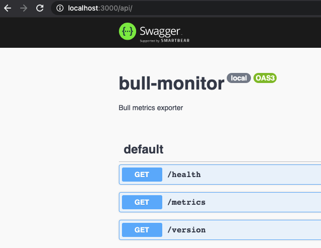

# bull-monitor
This is an all-in-one tool to help you visualize and report on bull! It runs as a docker container that you can spin up with local development or host wherever you see fit. The core goal of this project is to provide realtime integration of your bull queues with existing bull tooling...without needing to run write any custom code. The following is automatically included:

- Automatic discovery of your bull queues (just point this at your redis instance)
- Automatic configuration of prometheus metrics for each discovered queue
- Configurable UI support to visualize bull queues (Bull Board or Arena)

## screenshots
[]
[]
[]
[]
[]


## getting started

To get started:

  docker compose up -d bull-exporter

If you are using `docker-compose` you can add the following:

```yml

```

## prometheus metrics
- List of metrics
- Grafana integration
- Queue metrics are GLOBAL not worker specific

## bull ui

## todo

## security considerations
- Should not be publically accessible in production environment
- Single threaded should not scale

If you want to also run prometheus and grafana:

  docker compose up -d grafana

What's where?
- `/metrics`
- `/health`
- `/api` - swagger documentation of available endpoints
- `/queues` - UI for bull

Other services:
- localhost:3000 - bull exporter
- localhost:6002 - smtp
- localhost:6003 - SMTP Web UI (username: test, password: test)
- localhost:3001 - grafana
- localhost:3002 - prometheus

# contributing
- Open a PR

## TODO
- Config namespace events - how to ensure this is properly set????
- Clusters - ensure we can scan all queues in a cluster
- Docker container creation
- Github actions to build container and push to docker hub
- Dex/SAML/OIDC login
- Bull dashboard for grafana (to be loaded)
- Istio metrics?
- Screenshots/documentation
- Basic smoke testing
- Code climate / other code quality tools