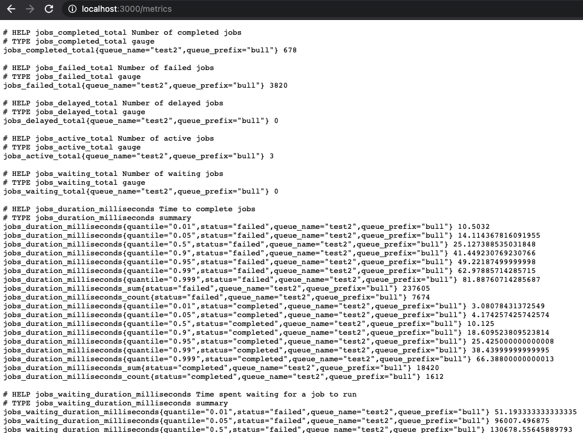

# bull-monitor
This is an all-in-one tool to help you visualize and report on bull! It runs as a docker container that you can spin up with local development or host wherever you see fit. The core goal of this project is to provide realtime integration of your bull queues with existing bull tooling...without needing to run write any custom code. The following is automatically included:

- Automatic discovery of your bull queues (just point this at your redis instance)
- Automatic configuration of prometheus metrics for each discovered queue
- Configurable UI support to visualize bull queues (Bull Board or Arena)

## getting started

To get started:

  docker compose up -d bull-exporter

If you are using `docker-compose` you can add the following:

```yml
bull-exporter:
  image: bull-exporter:latest
  ports: 
    - 3000:3000
  environment:
    REDIS_HOST: <your redis host>
    REDIS_PORT: <your redis port>
    PORT: 3000
    UI: bull-board # options: arena, bull-board
```

You can then create a sample job like this (assuming redis is running at `127.0.0.1:6001`):

```typescript
import Bull from 'bull'

// create queue
const queue = new Bull('send-email', {
    redis: {
        host: 127.0.01,
        port: config.REDIS_PORT
    }
});

// add some dummy processing code
queue.process(async (job) => {
  const delay = Math.floor(Math.random() * config.DELAY_MS)
  console.log(`Starting job: ${job.id} with delay ${delay}`);
  job.log(`Starting job: ${job.id} with delay ${delay}`);

  const fail = Math.round(Math.random()) === 1 
  if (fail) {
    console.log(`Job ${job.id} marked to fail`);
    job.log(`Job ${job.id} marked to fail`);
    throw new Error(`Failing job ${job.id} for random reason`)
  }
  
  console.log(`Job ${job.id} is now complete after the delay`);
  job.log(`Job ${job.id} is now complete after the delay`);
});

// create a job
queue.add({someParam: 'someValue'}, {attempts: 2});
```

The example above creates a job queue called `send-email` with processing code that fails randomly. It creates a single job and attempts it up to 4 times.

## What's where?
If you're running this example then bull exporter should be running at `localhost:3000` and have the following endpoints available:
- `/metrics`
- `/health`
- `/api` - swagger documentation of available endpoints
- `/queues` - UI for bull

Other services (`docker compose up -d` to run everything):
- localhost:3000 - Bull Monitor (this project!)
- localhost:6002 - SMTP (anonymous allowed)
- localhost:6003 - SMTP Web UI (username: `test`, password: `test`)
- localhost:3001 - Grafana
- localhost:3002 - Prometheus

## prometheus metrics
For each queue that is created  the following metrics are automatically tracked.

| Metric                              | type    | description                                             |
|-------------------------------------|---------|---------------------------------------------------------|
| jobs_completed_total                | counter | Total number of completed jobs                          |
| jobs_active_total                   | counter | Total number of active jobs (currently being processed) |
| jobs_delayed_total                  | counter | Total number of jobs that will run in the future        |
| jobs_failed_total                   | counter | Total number of failed jobs                             |
| jobs_waiting_total                  | counter | Total number of jobs waiting to be processed            |
| jobs_duration_milliseconds          | summary | Processing time for completed/failed                    |
| jobs_waiting_duration_milliseconds  | summary | Waiting time for completed/failed                       |
| jobs_attempts                       | summary | Processing time for completed/failed/jobs               |

Things to note about these metrics:
- Queue metrics are GLOBAL not worker specific
- Queue metrics are refreshed every 60 seconds. To change this simply you'll need to set environment variable `BULL_COLLECT_QUEUE_METRICS_INTERVAL_MS` to another value.
- Available prometheus labels: `queue_name`, `queue_prefix`, `status`

An example of the exposed metrics endpoint:


Note that you can integrate this with Grafana to set up things like alerts. If you want to try this out locally this repo contains all the wiring needed for grafana. To use that:

```
docker compose up -d grafana bull-exporter
```

This will launch grafana on `localhost:3001` (anonymous login).


## bull ui
There are 2 options currently available for UIs: bull-board and arena.

### bull-board
From: https://github.com/felixmosh/bull-board#readme. This is the default UI. If you want to be explicit just set `UI` environment variable to `bull-board`.


### bull-arena
From: https://github.com/bee-queue/arena. To use this UI you'll need to set the `UI` environment variable to `arena`.


## security considerations
- This is intended as a back office monitoring solution. You should not make expose this publicly
- This is currently intended to run as a single process and should not be scaled horizontally (future todo item)

## todo
A non-exhaustive list of some things that would be nice to have in the future. PRs welcome!

- Config namespace events - how to ensure this is properly set????
- Clusters - ensure we can scan all queues in a cluster
- Docker container creation
- Github actions to build container and push to docker hub
- Dex/SAML/OIDC login
- Bull dashboard for grafana (to be loaded)
- Istio metrics?
- Screenshots/documentation
- Basic smoke testing
- Code climate / other code quality tools
- Improve smoke testing
- Bull - better queue retrieval methods from redis (using `SCAN` to accomplish this)
- Bull board - public add/remove queues
- Bull arena - public add/remove queues
- ncc compilation
- error handling (what happens about job event replay if we get disconnected?)
- whitelabeling
