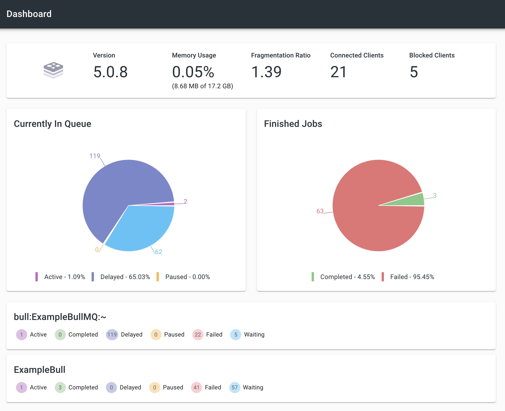

# bull-monitor

[](https://codeclimate.com/github/ejhayes/bull-monitor/maintainability) [](https://codeclimate.com/github/ejhayes/bull-monitor/test_coverage) [](https://hub.docker.com/r/ejhayes/nodejs-bull-monitor) <!-- ALL-CONTRIBUTORS-BADGE:START - Do not remove or modify this section -->
[](#contributors-)

<!-- ALL-CONTRIBUTORS-BADGE:END -->


This is an all-in-one tool to help you visualize and report on bull! It runs as a docker container that you can spin up with local development or host wherever you see fit. The core goal of this project is to provide realtime integration of your bull queues with existing bull tooling...without needing to run write any custom code. The following is automatically included:

- Automatic discovery of your bull queues (just point this at your redis instance)
- Automatic configuration of prometheus metrics for each discovered queue
- Configurable UI support to visualize bull queues (supported: [`arena`](https://github.com/bee-queue/arena#readme), [`bull-board`](https://github.com/felixmosh/bull-board), [`bull-master`](https://github.com/hans-lizihan/bull-master))
- Sentry error reporting (just pass `SENTRY_DSN` environment variable)
- [Elastic ECS](https://www.elastic.co/what-is/ecs) logging when `NODE_ENV` is set to `production`
- Bundled `oauth2_proxy` if you want to restrict access (disabled by default)

You can test it out with docker by running (if you want to access something running on your host machine and not within the docker network you can use the special hostname [`host.docker.internal`](https://docs.docker.com/docker-for-mac/networking/#use-cases-and-workarounds)):

```sh
docker run -d --rm \
  --name bull-monitor \
  -e "NODE_ENV=development" \
  -e "REDIS_HOST=host.docker.internal" \
  -e "REDIS_PORT=6001" \
  -e "PORT=3000" \
  -e "BULL_WATCH_QUEUE_PREFIXES=bull" \
  -e "UI=bull-master" \
  -p 3000:3000 \
  ejhayes/nodejs-bull-monitor:latest
```

To use with docker compose, add the following to `docker-compose.yml`:

```yml
bull-monitor:
  image: ejhayes/nodejs-bull-monitor:latest
  ports:
    - 3000:3000
  environment:
    REDIS_HOST: <your redis host>
    REDIS_PORT: <your redis port>
    BULL_WATCH_QUEUE_PREFIXES: bull
    PORT: 3000
    UI: bull-master
```

Then run `docker-compose up bull-monitor`. Assuming no issues, the following paths are available:

| Path                                  | Description                                                                                                                         |
| ------------------------------------- | ----------------------------------------------------------------------------------------------------------------------------------- |
| [`/metrics`](localhos:3000/metrics)   | Prometheus metrics                                                                                                                  |
| [`/health`](localhos:3000/metrics)    | Health endpoint (always returns `HTTP 200` with `OK` text)                                                                          |
| [`/docs`](localhos:3000/metrics)      | Swagger UI                                                                                                                          |
| [`/docs-json`](localhos:3000/metrics) | Swagger JSON definition                                                                                                             |
| [`/queues`](localhos:3000/metrics)    | Bull UI (currently [`arena`](https://www.npmjs.com/package/bull-arena) or [`bull-board`](https://www.npmjs.com/package/bull-board)) |

## configuration

The following environment variables are supported:

| Environment Variable                     | Required | Default Value  | Description                                                                                                                                                              |
| ---------------------------------------- | -------- | -------------- | ------------------------------------------------------------------------------------------------------------------------------------------------------------------------ |
| `ALTERNATE_PORT`                         |          | `8081`         | If oauth2 proxy is enabled bull monitor will run on this port instead                                                                                                    |
| `REDIS_HOST`                             | x        | `null`         | Redis host (**IMPORTANT** must be same redis instance that stores bull jobs!)                                                                                            |
| `REDIS_PORT`                             | x        | `null`         | Redis port                                                                                                                                                               |
| `REDIS_PASSWORD`                         |          | `null`         | Redis password                                                                                                                                                           |
| `UI`                                     |          | `bull-board`   | UI to use (supported: `arena`, `bull-board`)                                                                                                                             |
| `BULL_WATCH_QUEUE_PREFIXES`              |          | `bull`         | Bull prefixes to monitor (globs like `prefix*` are supported)                                                                                                            |
| `BULL_COLLECT_QUEUE_METRICS_INTERVAL_MS` |          | `60000`        | How often queue metrics are gathered                                                                                                                                     |
| `COLLECT_NODEJS_METRICS`                 |          | `false`        | Collect NodeJS metrics and expose via prometheus                                                                                                                         |
| `COLLECT_NODEJS_METRICS_INTERVAL_MS`     |          | `60000`        | How often to calculate NodeJS metrics (if enabled)                                                                                                                       |
| `REDIS_CONFIGURE_KEYSPACE_NOTIFICATIONS` |          | `true`         | Automatically configures redis keyspace notifications (typically not enabled by default). **IMPORTANT**: This will _NOT_ work without keyspace notifications configured. |
| `LOG_LABEL`                              |          | `bull-monitor` | Log label to use                                                                                                                                                         |
| `LOG_LEVEL`                              |          | `info`         | Log level to use (supported: `debug`, `error`, `info`, `warn`)                                                                                                           |
| `NODE_ENV`                               |          | `production`   | Node environment (use `development` for colorized logging)                                                                                                               |
| `OAUTH2_PROXY_*`                         |          | `null`         | See [OAuth2 Proxy docs](https://oauth2-proxy.github.io/oauth2-proxy/docs/configuration/overview/#environment-variables) for more details                                 |
| `PORT`                                   |          | `3000`         | Port to use                                                                                                                                                              |
| `SENTRY_DSN`                             |          | `null`         | Sentry DSN to send errors to (disabled if not provided)                                                                                                                  |
| `USE_OAUTH2_PROXY`                       |          | `0`            | Enable oauth2 proxy (anything other than `1` will disable)                                                                                                               |

## getting started

To get started:

```
npm install
npm run services:start
npm run start:dev
```

If you want to run the tests:

```
npm run test
npm run test:e2e
```

To build the container (will be built/tagged as `ejhayes/nodejs-bull-monitor`):

```
npm run ci:build
```

## generating quues/workers

A test script is included so you can try creating and/or processing bull jobs. Examples:

```
# create a queue and add jobs to it (no processing)
npm run generate:create

# process queue jobs only
npm run generate:process

# create and process jobs
npm run generate
```

The default behavior of `npm run generate` is to:

- Create `MyBullQueue` queue if it doesn't exist.
- Add a dummy job every `10` milliseconds.
- Add a worker that with concurrency `15` that processes up to `200` jobs per `1` second (jobs retried up to `4` times).
- Configure each job to take up to `200` milliseconds. Jobs can fail randomly.

See `./test.ts` for more details.

## prometheus metrics

_NOTE:_ metrics are available at the `/metrics` endpoint

For each queue that is created the following metrics are automatically tracked.

| Metric                 | type      | description                                         |
| ---------------------- | --------- | --------------------------------------------------- |
| `jobs_completed_total` | `gauge`   | Total number of completed jobs                      |
| `jobs_failed_total`    | `gauge`   | Total number of failed jobs                         |
| `jobs_delayed_total`   | `gauge`   | Total number of delayed jobs                        |
| `jobs_active_total`    | `gauge`   | Total number of active jobs                         |
| `jobs_waiting_total`   | `gauge`   | Total number of waiting jobs                        |
| `jobs_active`          | `counter` | Jobs active                                         |
| `jobs_waiting`         | `counter` | Jobs waiting                                        |
| `jobs_stalled`         | `counter` | Jobs stalled                                        |
| `jobs_failed`          | `counter` | Jobs failed                                         |
| `jobs_completed`       | `counter` | Jobs completed                                      |
| `jobs_delayed`         | `counter` | Jobs delayed                                        |
| `job_duration`         | `summary` | Processing time for completed/failed jobs           |
| `job_wait_duration`    | `summary` | Durating spent waiting for job to start             |
| `job_attempts`         | `summary` | Number of attempts made before job completed/failed |

The following labels are available:

| Label Name     | Description                                 |
| -------------- | ------------------------------------------- |
| `queue_prefix` | Queue Prefix                                |
| `queue_name`   | Queue Name                                  |
| `job_name`     | Job name                                    |
| `status`       | Job status (choiced: `completed`, `failed`) |
| `error_type`   | Error type (uses error class name)          |

Things to note about these metrics:

- Queue metrics are GLOBAL not worker specific
- Gauge metrics (`*_total`) are refreshed every 60 seconds. To change this you'll need to set environment variable `BULL_COLLECT_QUEUE_METRICS_INTERVAL_MS` to another value.

## grafana support

You can visualize your queue metrics in Grafana! There are several pieces that need to be running for this to work:

- `bull-monitor` - this utility must be running (and the `/metrics` endpoint should be accessible)
- `prometheus` - you need to be running prometheus and have it configured to scrape `bull-monitor`
- `grafana` - grafana needs to be setup and configured to scrape data from prometheus

If you want to play around with a local setup of this:

```
# start services
npm run services:start
npm run start:dev

# generate/process dummy data
npm run generate
```

You can now go to: http://localhost:3001/dashboard/import and load dashboards:

| Grafana Dashboard Name | Grafana ID                                            | Description                                      | Screenshot                                  |
| ---------------------- | ----------------------------------------------------- | ------------------------------------------------ | ------------------------------------------- |
| Queue Overview         | [14538](https://grafana.com/grafana/dashboards/14538) | High level overview of all monitored bull queues |      |
| Queue Specific         | [14537](https://grafana.com/grafana/dashboards/14537) | Queue specific details                           |  |

## Available UIs

There are 3 options currently available for UIs: `bull-board`, `arena`, and `bull-master`.

### bull-board

From: https://github.com/felixmosh/bull-board#readme. This is the default UI. If you want to be explicit just set `UI` environment variable to `bull-board`.


### bull-master

From: https://github.com/hans-lizihan/bull-master. To use this UI you'll need to set the `UI` environment variable to `bull-master`.



### bull-arena

From: https://github.com/bee-queue/arena. To use this UI you'll need to set the `UI` environment variable to `arena`.


## OAuth2 Proxy

You can restrict access to bull monitor using the built in OAuth2 proxy. To enable you'll need the following environment variables at a minimum:

- `USE_OAUTH2_PROXY` (must be set to `1`)
- `OAUTH2_PROXY_REDIRECT_URL` (this is what the oauth provider will be redirecting to)
- `OAUTH2_PROXY_CLIENT_ID`
- `OAUTH2_PROXY_SECRET_ID`

Many other configuration options are possible. See the [OAuth2 Proxy documentation](https://oauth2-proxy.github.io/oauth2-proxy/docs/configuration/overview/#environment-variables) for more information.

## Security Considerations

- This is intended as a back office monitoring solution. You should not make expose this publicly
- This is currently intended to run as a single process and should not be scaled horizontally (future todo item)

## Local Development

You can spin up a full local development environment by running:

```
# start services
npm run services:start
npm run start:dev
```

The following services are available (and automatically configured) at these locations:

- Grafana UI: http://localhost:3001
- Prometheus: http://localhost:3002
- SMTP (Mailhog): http:localhost: http://localhost:3003 (username: `test`, password: `test`)
- Redis: `localhost:6001`
- SMTP Server (used by Grafana Alerts): `localhost:6002` (no auth required, no encryption)

When you are done you can get rid of everything with:

```
npm run services:remove

# OR if you want to stop without removing
npm run services:stop
```

## Roadmap

See the [roadmap](https://github.com/ejhayes/bull-monitor/projects/1) for idas on how to improve this project.

## Contributors ✨

Thanks goes to these wonderful people ([emoji key](https://allcontributors.org/docs/en/emoji-key)):

<!-- ALL-CONTRIBUTORS-LIST:START - Do not remove or modify this section -->
<!-- prettier-ignore-start -->
<!-- markdownlint-disable -->
<table>
  <tr>
    <td align="center"><a href="https://github.com/ejhayes"><br /><sub><b>Eric Hayes</b></sub></a><br /><a href="https://github.com/ejhayes/bull-monitor/commits?author=ejhayes" title="Documentation">📖</a> <a href="#infra-ejhayes" title="Infrastructure (Hosting, Build-Tools, etc)">🚇</a> <a href="https://github.com/ejhayes/bull-monitor/commits?author=ejhayes" title="Tests">⚠️</a> <a href="https://github.com/ejhayes/bull-monitor/commits?author=ejhayes" title="Code">💻</a></td>
  </tr>
</table>

<!-- markdownlint-restore -->
<!-- prettier-ignore-end -->

<!-- ALL-CONTRIBUTORS-LIST:END -->

This project follows the [all-contributors](https://github.com/all-contributors/all-contributors) specification. Contributions of any kind welcome!
